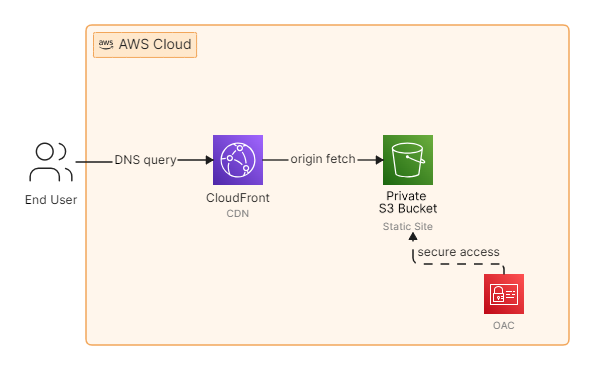
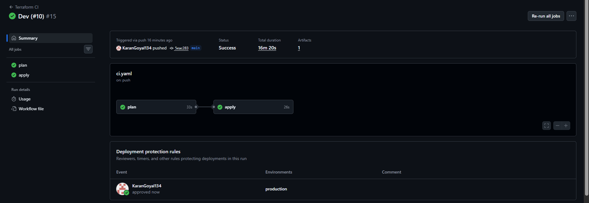
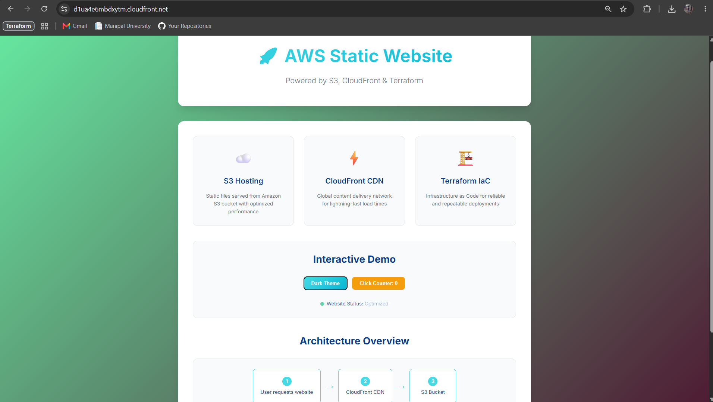

# Terraform AWS Static Website

Provision and manage a static website on AWS using **Terraform**, **S3**, and **CloudFront** — deployed via a **GitHub Actions CI/CD pipeline** using **OIDC** (no long-lived AWS credentials).

---

## Architecture



**How it works:**

1. The **End User** sends a DNS query and is routed to **CloudFront**.
2. **CloudFront** acts as the CDN — it caches and serves content, and on a cache miss performs an **origin fetch** to the S3 bucket.
3. The **S3 bucket** is **fully private** (all public access is blocked via `aws_s3_bucket_public_access_block`). It hosts the static site files (HTML/CSS/JS).
4. An **Origin Access Control (OAC)** grants CloudFront — and only CloudFront — secure, signed access to the private bucket. The bucket policy explicitly allows `s3:GetObject` only when the request's `AWS:SourceArn` matches this specific CloudFront distribution.

This means the website is **never directly accessible via the S3 URL** — every request must go through CloudFront.

---

## Project Structure

```
.
├── .github/workflows/
│   └── ci.yaml              # CI/CD pipeline (plan -> manual approval -> apply)
├── www/                      # Static site source (HTML/CSS/JS)
│   ├── index.html
│   ├── style.css
│   └── script.js
├── main.tf                   # S3 bucket, OAC, bucket policy, CloudFront distribution
├── locals.tf                 # Local values (S3 origin id)
├── variables.tf              # Input variables (bucket_name)
├── outputs.tf                # Outputs (cloudfront_url)
├── provider.tf                # Terraform/provider config + S3 remote backend
├── .tfvars.example            # Example variable values
└── .gitignore
```

---

## Infrastructure Components

| Component | Resource | Purpose |
|---|---|---|
| **S3 Bucket** | `aws_s3_bucket.host_bucket` | Hosts the static website files |
| **Public Access Block** | `aws_s3_bucket_public_access_block.pab` | Blocks all public access — bucket is fully private |
| **Origin Access Control** | `aws_cloudfront_origin_access_control.cloudfront_s3_oac` | Lets CloudFront securely sign requests to S3 |
| **Bucket Policy** | `aws_s3_bucket_policy.cloudfront_access` | Allows `s3:GetObject` only from this CloudFront distribution's ARN |
| **S3 Objects** | `aws_s3_object.object` | Uploads every file under `www/` to the bucket, with correct `Content-Type` per extension |
| **CloudFront Distribution** | `aws_cloudfront_distribution.s3_distribution` | Serves the site over HTTPS, with `index.html` as the default root object and a 403 → `index.html` (200) custom error response |

### Remote State Backend

State is **not** stored locally. It's stored remotely in an **S3 backend**:

```hcl
backend "s3" {
  key          = "prod/terraform.tfstate"
  region       = "us-east-1"
  use_lockfile = true
}
```

- The bucket name itself is **not hardcoded** — it's injected at `terraform init` time via `-backend-config="bucket=..."`, sourced from a GitHub Actions variable.
- `use_lockfile = true` enables native S3 state locking (no separate DynamoDB lock table required).
- The remote state bucket is expected to be **versioned and encrypted**.

---

## CI/CD Pipeline (GitHub Actions)

The pipeline (`.github/workflows/ci.yaml`) runs on every push to `main` and has two jobs:

### 1. `plan` job
- Checks out the code.
- Authenticates to AWS using **OIDC** — `aws-actions/configure-aws-credentials` assumes an IAM role (`vars.ROLE_ARN`) via GitHub's OIDC identity provider. **No AWS access keys are stored as secrets.**
- Runs `terraform init`, pointing at the remote state bucket via `vars.TF_REMOTE_STATE_BUCKET`.
- Runs `terraform validate`.
- Runs `terraform plan`, passing the target website bucket name via `vars.TF_VAR_BUCKET_NAME`.
- Uploads the plan file (`tfplan`) as a **GitHub Actions artifact** for review.

#### Successful Artifact Generated


### 2. `apply` job
- Depends on (`needs:`) the `plan` job.
- Runs under the `production` **GitHub Environment**, which is configured with a **required reviewer** — so the pipeline pauses and waits for manual approval before this job runs.
- Re-authenticates via OIDC, re-runs `terraform init` against the same backend.
- Downloads the exact plan artifact produced by the `plan` job.
- Runs `terraform apply -auto-approve tfplan` — applying precisely what was reviewed, with no drift between plan and apply.

### GitHub Variables used

| Variable | Used for |
|---|---|
| `ROLE_ARN` | IAM role assumed via OIDC for both jobs |
| `TF_REMOTE_STATE_BUCKET` | S3 bucket used as the Terraform backend |
| `TF_VAR_BUCKET_NAME` | Name of the S3 bucket created to host the static website |

### Successful Workflow Run



---

## Deployed Website

Terraform outputs the CloudFront URL after a successful apply:

```hcl
output "cloudfront_url" {
  description = "The CloudFront distribution's default domain name"
  value       = "https://${aws_cloudfront_distribution.s3_distribution.domain_name}"
}
```

**Live URL:** `https://<your-cloudfront-domain>.cloudfront.net`
> *Replace this with the actual `cloudfront_url` output value from your `terraform apply` / pipeline run.*

### Website Preview



---

## Getting Started (Local)

```bash
# 1. Initialize with your remote state bucket
terraform init -backend-config="bucket=<your-tf-state-bucket>"

# 2. Copy and edit variables
cp .tfvars.example terraform.tfvars
# edit terraform.tfvars -> bucket_name = "your-unique-bucket-name"

# 3. Plan
terraform plan

# 4. Apply
terraform apply
```

> In CI, `bucket_name` is passed in directly via `-var` from the `TF_VAR_BUCKET_NAME` GitHub variable, so `terraform.tfvars` is only needed for local runs.

---

## Security Notes

- The S3 bucket has **all public access blocked** — there is no public bucket policy or ACL.
- Access is restricted to a **single named CloudFront distribution** via the OAC + `AWS:SourceArn` condition — not just "any CloudFront", and not "anyone with the bucket URL".
- The CI pipeline uses **GitHub OIDC** to assume an AWS IAM role — eliminating static AWS credentials in GitHub Secrets.
- Production changes require **manual approval** via a GitHub Environment protection rule before `terraform apply` runs.
- The remote state bucket should be **versioned and server-side encrypted** to protect the Terraform state (which may contain sensitive resource metadata).
